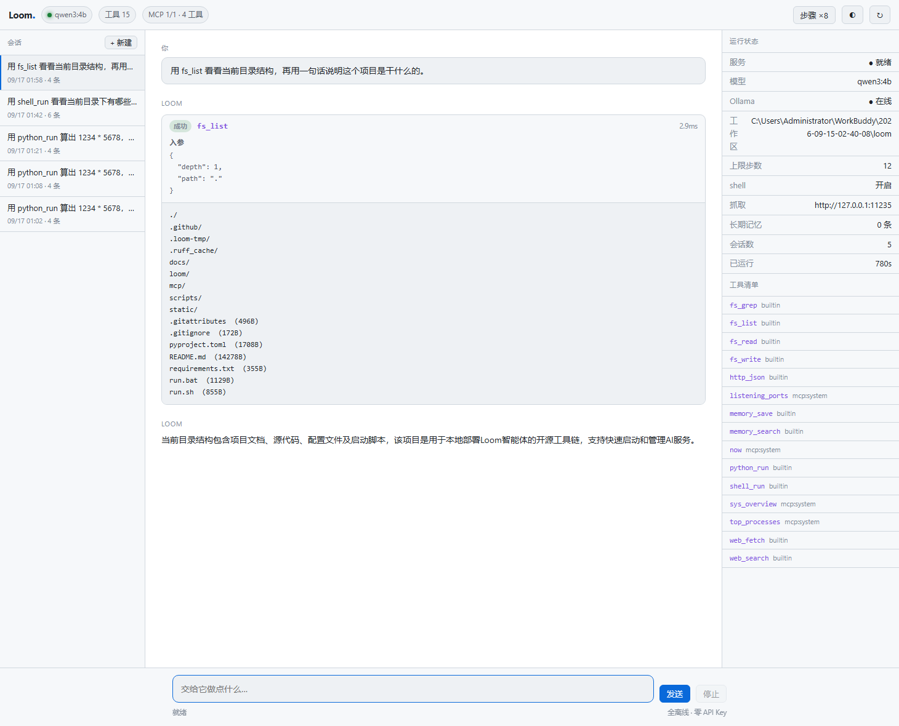

# Loom

**本地优先 · MCP 原生 · 零 API Key 的智能体运行时。**

Loom 不自己造轮子。它把世上最强的现成开源件组装成一个**真的会干活**的智能体：

| 能力 | 复用的东西 | 为什么是它 |
|---|---|---|
| 推理 | **[Ollama](https://ollama.com)** + Qwen3 | 本地模型运行时的行业标准，一条命令换模型，全程不联网 |
| 工具 | **[MCP](https://modelcontextprotocol.io)**（官方 SDK） | 事实标准。配一个 JSON 就接入整个生态里现成的服务器 |
| 抓取 | **[crawl4ai](https://github.com/unclecode/crawl4ai)** | 把网页转成适合模型读的 Markdown，正文提取质量远超正则扒 HTML |

Loom 自己只写两样东西：**协议翻译**（把工具翻译成模型看得懂的 schema，把结果翻译回结构化观测）和**产品体验**。算法一行没碰。



```
用户 ──▶ Loom 智能体循环 ──▶ Ollama（本地推理）
                │                    ▲
                │  工具调用            │  观测回灌
                ▼                    │
        ┌───────────────────────────┴──────┐
        │ 内置工具：fs / shell / web / python │
        │ MCP 服务器：任意 stdio 服务器       │
        │ 长期记忆：SQLite，跨会话可检索       │
        └───────────────────────────────────┘
```

---

## 快速开始

```bash
# 1) 装 Ollama，拉一个本地模型（约 2.5 GB）
ollama pull qwen3:4b

# 2) 起 Loom（首次自动建 venv、装依赖）
./run.sh              # macOS / Linux
run.bat               # Windows
```

打开 <http://127.0.0.1:8790>，直接说话就行。

想让它更聪明就换大模型：`ollama pull qwen3:8b`，然后在界面上或 `LOOM_MODEL=qwen3:8b` 指定。

### 命令行也能用

```bash
python -m loom chat "看看当前目录里有什么，用一句话总结这个项目"
python -m loom tools        # 列出内置工具
python -m loom mcp          # 列出 MCP 服务器并入的工具
python -m loom selftest     # 跑不变量自检（离线，不需要模型）
python -m loom smoke        # 端到端冒烟（需要模型）
```

---

## 接入 MCP 生态

Loom 一个字节的 MCP 协议都不自己实现，全部走官方 SDK。于是任何 MCP 服务器——官方的、社区的、你自己写的——只要写进 `mcp/servers.json` 就能被模型使用：

```json
{
  "mcpServers": {
    "system": {
      "command": "{python}",
      "args": ["{root}/mcp/system_server.py"]
    },
    "filesystem": {
      "command": "npx",
      "args": ["-y", "@modelcontextprotocol/server-filesystem", "{workdir}"]
    },
    "git": {
      "command": "uvx",
      "args": ["mcp-server-git", "--repository", "{workdir}"]
    }
  }
}
```

`{python}` / `{root}` / `{workdir}` 会被替换成本机的真实路径 —— **所以同一份配置能在任何机器上直接跑**，不用改绝对路径。

`mcp/servers.example.json` 里还列了 filesystem / fetch / git / sqlite / time 几个官方服务器的现成配置，删掉 `"disabled": true` 就能用。

> 仓库自带 `mcp/system_server.py`：一个真实可用的 MCP 服务器，把本机内存、磁盘、进程、监听端口、时间暴露给智能体。它同时也是「怎么写一个 MCP 服务器」的可运行示例。

---

## 安全模型

给模型 shell 权限是要负责任的。Loom 的边界按层叠起来：

| 层 | 规则 |
|---|---|
| **文件沙箱** | 所有文件操作被限制在 `LOOM_WORKDIR` 内。`..` 穿越、绝对路径、符号链接逃逸一律拒绝 |
| **命令闸门** | 16 条破坏性命令模式（`rm -rf /`、`mkfs`、`format C:`、`reg delete`、fork bomb…）直接拒绝，连执行都不执行 |
| **超时** | 每个工具调用都有硬超时（默认 60s），跑飞的命令会被掐掉 |
| **观测截断** | 单个工具结果回灌给模型前先截断（默认 6000 字符），防止一个大文件撑爆上下文 |
| **步数上限** | 单轮最多 `LOOM_MAX_STEPS` 次「模型 → 工具」往返（默认 12），模型绕圈也绕不出去 |
| **关掉 shell** | `LOOM_SHELL=0` 直接把 shell 工具摘掉 |

失败**永远不会**中断循环：工具抛异常会被翻译成 `{"ok": false, "content": "..."}` 回灌给模型，让它读错误信息自救。这是它看起来「会用工具」还是「看起来会用工具」的分界线。

---

## 协议不变量（自检在守的东西）

模型协议里有几条铁律，破了整个会话就废。Loom 把它们钉成了自检断言：

1. **每一条带 `tool_calls` 的 assistant 消息，后面必须紧跟数量相等、id 一一对应的 tool 响应。**
   缺一条，Ollama / OpenAI 都会拒绝整个会话。自检里有一条专门的 `protocol_violations()` 扫描。连**上下文窗口裁剪**都不能破坏它 —— 裁到一半的 tool 块要么整块保留，要么整块丢弃。
2. **循环必然终止。** 模型无限要调工具时，在 `max_steps` 处精确停下。自检断言「模型被调用次数恰好等于 `max_steps`」。
3. **上限内的最后一轮，工具仍然执行。** 否则那条 assistant 消息就没有对应的 tool 响应，第 1 条立刻被破坏。
4. **工具失败不中断循环。** 断言「先失败后重试」的会话最终能给出答案，且协议完整。
5. **沙箱必须两边都规范化再比较。** Windows 上 `%TEMP%` 常是短名（`ADMINI~1`），而 `Path.resolve()` 展开成长名 —— 不规范化就会把合法访问误判成越界。
6. **system 提示词每一轮都要重新注入。** 它属于代码、不属于用户数据，所以不入库；但反过来，绝不能只在会话第一轮注入 —— 否则从第二轮起模型丢了全部行为约束，退化成裸模型。写成 `if not history: history = [system]` 就会踩这个坑。

```bash
$ python -m loom selftest
   [PASS] [schema] 声明的参数在实现签名里都存在（防漂移）
   [PASS] [沙箱] 拒绝越界路径 '../../etc/passwd'
   [PASS] [安全] 破坏性命令全部被拒
   [PASS] [协议] 每个 tool_call 恰好一个匹配 id 的 tool 响应
   [PASS] [循环] 模型调用次数恰好等于 max_steps（上限精确生效）
   [PASS] [上下文] 裁剪没有拆散 tool_call 与 tool 响应
   [PASS] [提示词] 第二轮（历史非空）依然注入 system
   [PASS] [MCP] 占位符 {python}/{root} 被展开成绝对可用路径
   ...

80/80 checks passed
ALL GREEN
```

**为什么自检不用真模型**：真模型每次输出都不一样，拿它当门禁会偶发失败，最后所有人都学会忽略红灯。这里用 `ScriptedBackend` 按脚本回放，把协议钉死；真模型的端到端验证交给 `python -m loom smoke`，那是另一档。

---

## 性能：为什么线程要锁在 2–4

**小模型解码是内存带宽瓶颈，不是算力瓶颈。** 线程开得越多，核心之间抢内存总线越凶，反而更慢。

实测（Ryzen 7 8C/16T · `qwen3:4b` Q4_K_M · 128 token 固定提示词）：

| `num_thread` | 生成 tok/s | 预填 tok/s |
|---:|---:|---:|
| 2 | 4.83 | 30.7 |
| **4** | **4.85** | 56.3 |
| 6 | 4.66 | 63.1 |
| 8 | 4.09 | 69.3 |
| 12 | 2.87 | 61.9 |
| 16 | **2.52** | 65.9 |

**16 线程比 4 线程慢 1.93×。** 所以 `auto_threads()` 把它锁死在 `[2, 4]`，不跟随 CPU 核数。

> 有意思的是预填充（prompt eval）反而是 8 线程最快（69.3 tok/s），但预填充比解码快一个数量级，
> 端到端耗时由解码主导 —— 所以按解码调优。想看你自己机器的最优值：
> `python scripts/bench_threads.py qwen3:4b 2,4,6,8,12,16`

另一个值得说的坑是**思维链开关**。第一直觉是「关掉思考能快很多」，于是给 Ollama 传
`think: false` —— 结果反而更糟。实测（`qwen3:4b`，同一提示词，`num_predict=500`）：

| 传参 | `thinking` 字段 | `content` | 速度 |
|---|---|---:|---:|
| 不传 / `true` | 671 字符（推理在这里） | **0 字符（干净）** | 4.59 tok/s |
| `think: false` | 0 | **671 字符（推理混进正文）** | 4.51 tok/s |

Qwen3-4B 无论你怎么要求都会先想一遍。`think: false` **一个 token 都没省**，
它只是让 Ollama 不再把推理分流到 `thinking` 字段 —— 于是那整段"首先我需要确认…"
直接落进 `content`，变成给用户看的正式回答。

所以 Loom 默认**根本不发这个字段**：推理走 `thinking` 通道，界面上渲染成可折叠的"思考"块，
`content` 保持干净。真想省 CPU，换一个本来就不思考的模型（如 `qwen2.5:3b-instruct`），
而不是指望这个开关。

> 复现：`python scripts/bench_threads.py` 扫描线程；`think` 的对照见上面这张表
> （改 `scripts/` 里的 `ask()` 第三个参数即可）。

### 3.3 思考块默认折叠

Qwen3-4B 一次「列目录 + 一句话总结」会生成 2000+ token 的推理，而正式回答只有 65 个字符。
推理**确实被正确分流**（实测首轮、工具往返后都是这样）：

```
[assistant] content=  0 字符  tool_calls=['fs_list']     ← 第一步只调工具，一个字不多说
[tool]                                  212 字符
[assistant] content= 65 字符  tool_calls=[]              ← 正式回答就这一句
    当前目录结构包含项目文档、源代码、配置文件及启动脚本，该项目是用于本地部署
    Loom 智能体的开源工具链，支持快速启动和管理 AI 服务。
```

所以界面把推理渲染成一个**默认折叠**的「思考过程（N 字）」块 —— 它是透明的证据，
但不该淹没答案。想看就展开，不看就一行带过。

`loop.py` 的 `SYSTEM_PROMPT` 里另有一段"输出纪律"，明确禁止把"用户让我…""首先我需要…"
这类内心独白写进正式回答 —— 对 4B 这种小模型，这条纪律是必要的。

---

## 配置

| 环境变量 | 默认 | 说明 |
|---|---|---|
| `LOOM_MODEL` | `qwen3:4b` | 用哪个 Ollama 模型 |
| `LOOM_OLLAMA_HOST` | `http://127.0.0.1:11434` | Ollama 地址 |
| `LOOM_WORKDIR` | 启动目录 | **文件沙箱的根**，所有读写被限制在这里 |
| `LOOM_THINK` | `auto` | 思维链开关。**默认 auto = 不向 Ollama 发这个字段**，原因见下节 —— 这是个反直觉但实测出来的结论 |
| `LOOM_NUM_THREADS` | 自动（2–4） | 推理线程数。**别跟随核数**，见下节 |
| `LOOM_SHELL` | `1` | 设为 `0` 关掉 shell 工具 |
| `LOOM_MAX_STEPS` | `12` | 单轮最多几趟「模型 → 工具」 |
| `LOOM_TOOL_TIMEOUT` | `60` | 单个工具调用的超时秒数 |
| `LOOM_MAX_OBSERVATION_CHARS` | `6000` | 单次观测回灌上限 |
| `LOOM_MAX_CONTEXT_MESSAGES` | `40` | 上下文滑窗消息数 |
| `LOOM_CRAWL4AI_URL` | `http://127.0.0.1:11235` | crawl4ai 地址；不可用时自动回退内置抓取 |
| `LOOM_CRAWL4AI` | `1` | 设为 `0` 直接用内置抓取 |
| `LOOM_MCP_CONFIG` | `mcp/servers.json` | MCP 配置路径 |
| `LOOM_PORT` / `LOOM_HOST` | `8790` / `127.0.0.1` | 服务监听 |

---

## 目录结构

```
loom/
├── loom/
│   ├── config.py      # 全部配置来自环境变量，零配置文件
│   ├── llm.py         # Ollama 流式客户端 + 可替换后端协议（ScriptedBackend 供自检用）
│   ├── tools.py       # 工具注册表、10 个内置工具、文件沙箱、命令闸门
│   ├── loop.py        # 智能体循环 —— 协议不变量的守卫都在这里
│   ├── mcp.py         # MCP 桥接：官方 SDK + 跨版本字段兼容层
│   ├── memory.py      # SQLite 会话 / 消息 / 长期记忆
│   ├── server.py      # FastAPI + SSE
│   ├── selftest.py    # 80 条不变量，离线可跑
│   └── __main__.py    # CLI
├── mcp/
│   ├── system_server.py     # 自带 MCP 服务器（本机运行状况）
│   └── servers.example.json # 官方服务器现成配置
├── static/index.html  # 单文件界面，零外部依赖
└── scripts/smoke_http.py
```

---

## 设计取舍

| 决定 | 取舍 |
|---|---|
| **自检不碰真模型** | 门禁必须 100% 确定性。真模型验证另开一档，宁可慢也不要假绿 |
| **工具结果返回结构化字典而非字符串** | 模型能看见 `ok: false` 和错误原因，才会自救而不是硬编答案 |
| **MCP 字段名逐个探测而不锁版本** | SDK 1.x→2.x 把 `inputSchema` 改成了 `input_schema`。锁版本会逼用户降级，探测则两边都能跑 |
| **服务端不用 sse-starlette** | 手写 SSE 帧只有三行，少一个依赖就少一处会在 CI 里炸的东西 |
| **界面单文件、零 CDN** | 全离线产品的界面去请求 CDN 是自相矛盾 |
| **文件沙箱用路径前缀判断** | 简单、可审计、没有绕过面。代价是符号链接指向外部时会被拒 —— 这是想要的行为 |

---

## 已知限制

- **CPU 推理慢，而且瓶颈是内存带宽。** 实测 `qwen3:4b` Q4_K_M 在 Ryzen 7 8C/16T 上
  约 **4.5–4.9 tok/s**（4 线程），一次「调工具 → 看结果 → 再回答」的往返约 5–7 分钟。
  没有 GPU 的话这是物理限制，不是实现问题。模型越大越慢，`qwen3:8b` 会明显更吃力。
- **`think: false` 不是提速开关**，见性能一节 —— 它只是破坏推理与答案的分流。
- **`web_search` 走 DuckDuckGo 的免 Key 端点**，可能被限流。失败时会明确告诉模型改用
  `web_fetch`，不会静默返回空结果。
- **没有多用户/鉴权。** 默认只监听 `127.0.0.1`，定位是个人本地工具。要暴露到局域网
  请自己加反向代理和认证。
- **上下文窗口靠滑窗裁剪**，不是真正的摘要压缩。对话很长时会丢掉早期轮次。
- **MCP 桥接按工具名扁平注册**，重名时自动加 `服务器名__` 前缀。如果你接的两个服务器
  有同名工具，模型看到的会是加前缀后的名字。

---

## 许可

MIT
